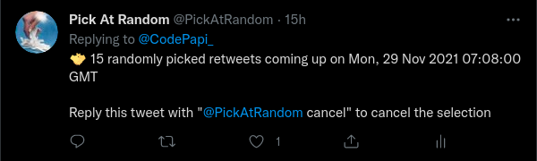
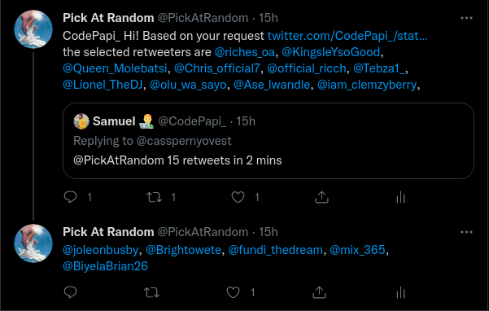

# pick-at-random

## What it does

[@PickAtRandom](https://twitter.com/PickAtRandom) selects Twitter users at random that showed interest in a giveaway via retweeting, replying or favouriting a tweet.

Let's say that a Twitter user wants to run a giveaway on Twitter; and the user makes an announcement about the giveaway via a tweet, which is usually in the form of

> *I'll be giving a PS5 to 5 random people who like this tweet*.

Other Twitter users engage with the tweet by liking it. Some retweet it and others reply to it.

All that the Twitter user that's running the giveaway needs to do is to to reply the original tweet with a tweet like

> *@PickAtRandom 5 likes in 1 hour*

and @PickAtRandom will respond after 1 hour with the handles of 5 randomly picked tweeps that faved the tweet.

## How does it work?

Requests made to @PickAtRandom are handled by a serverless function (`api/twitter-webhook-listener/handle-par-activity`) that listens for mentions to @PickAtRandom and parses and saves valid mentions as selection requests in a redis cache.

Another serverless function (`par-responder/handler/computeAndRespond`) runs a cron that polls the redis cache every minute for selection requests. If selection requests are found for that specific time, the function fetches tweeps who have engaged with the tweet for the engagement type stated in the request, selects tweeps at random and responds to the caller.

## Inspiration

Having noticed that selecting Twitter users that applied for a giveaway is arduous, [mykeels](https://github.com/mykeels) came up with an [idea for a Twitter bot](https://gist.github.com/mykeels/2c1a04301c7ef9cb54696529565c3b10) that does this task automatically.

Work on this bot was made easier by the awesome work already done in [@RemindMeOfThis](https://github.com/shalvah/RemindMeOfThisTweet)

## Screenshots

